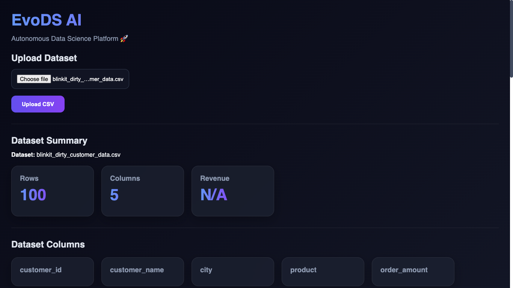

# 🚀 EvoDS AI - Automated Data Science & AutoML Platform

<p align="center">
  
</p>

<p align="center">
  <strong>Upload Data → Analyze → Visualize → Train Models → Predict Results</strong>
</p>

<p align="center">
  
  
  
  
  
  
  
</p>

---

# 📌 Overview

EvoDS AI is a full-stack Automated Data Science Platform that allows users to upload datasets, generate Exploratory Data Analysis (EDA) reports, visualize insights through charts, train Machine Learning models automatically, and make predictions using the best-performing model.

The platform is designed to simplify the complete Data Science workflow for analysts, students, and researchers.

---

# ✨ Features

### 📂 Dataset Upload

* Upload CSV datasets directly through the web interface
* Automatic dataset profiling
* Supports various real-world datasets

### 📊 Automated EDA

* Dataset summary
* Missing value analysis
* Top categories detection
* Revenue calculation
* Unique value insights

### 📈 Dynamic Visualizations

* Distribution Charts
* Missing Value Charts
* Category Frequency Charts
* Auto-generated insights

### 🤖 AutoML Training

* Random Forest
* Decision Tree
* K-Nearest Neighbors

### 🏆 Model Leaderboard

* Automatic model comparison
* Accuracy ranking
* Best model selection

### 🔮 Prediction Engine

* Dynamic prediction forms
* Automatic feature mapping
* Trained model inference

### ☁️ Deployment Ready

* Frontend deployed on Vercel
* Backend deployed on Render
* Production-ready architecture

---

# 🏗️ System Architecture

```text
User
 │
 ▼
React Frontend
 │
 ▼
FastAPI Backend
 │
 ├── CSV Upload
 ├── EDA Analysis
 ├── Chart Generation
 ├── AutoML Training
 └── Predictions
 │
 ▼
Machine Learning Models
(Random Forest, Decision Tree, KNN)
```

---

# 📸 Application Screenshots

## 🏠 Dashboard


---

## 📂 Dataset Upload


---

## 📊 EDA Report


---

## 📈 Charts & Insights


---

## 🤖 Model Training


---

## 🔮 Prediction Result


---

# 🧠 Machine Learning Workflow

```text
Upload Dataset
      │
      ▼
Data Cleaning
      │
      ▼
Feature Engineering
      │
      ▼
Train Multiple Models
      │
      ▼
Compare Accuracy
      │
      ▼
Select Best Model
      │
      ▼
Prediction
```

---

# 🛠️ Tech Stack

## Frontend

* React.js
* Axios
* CSS3
* Vite

## Backend

* FastAPI
* Pandas
* NumPy
* Joblib

## Machine Learning

* Scikit-Learn
* Random Forest
* Decision Tree
* KNN

## Deployment

* Vercel
* Render
* GitHub

---

# 📂 Project Structure

```text
EvoDS-AI
│
├── frontend
│   ├── src
│   ├── components
│   ├── pages
│   └── services
│
├── backend
│   ├── routes
│   ├── services
│   ├── uploads
│   ├── reports
│   └── models
│
├── assets
│
└── README.md
```

---

# ⚙️ Installation

## Clone Repository

```bash
git clone https://github.com/PawanJogi07/EvoDS-AI.git
cd EvoDS-AI
```

## Backend Setup

```bash
cd backend

pip install -r requirements.txt

uvicorn main:app --reload
```

Backend runs at:

```text
http://127.0.0.1:8000
```

---

## Frontend Setup

```bash
cd frontend

npm install

npm run dev
```

Frontend runs at:

```text
http://localhost:5173
```

---

# 🌐 Deployment

## Frontend

Deployed using Vercel

## Backend

Deployed using Render

---

# 🎯 Use Cases

* Data Analytics
* Business Intelligence
* Dataset Exploration
* Machine Learning Education
* Rapid Prototyping
* AutoML Experiments

---

# 🚀 Future Enhancements

* User Authentication
* LLM-based Insights
* PDF Report Generation
* Feature Importance Visualization
* Download Trained Models
* Cloud Storage Integration
* Advanced AutoML Algorithms
* Real-Time Analytics

---

# 👨‍💻 Developer

### Pawan Jogi

B.Tech Student | Data Analytics & AI Enthusiast

* Python
* Machine Learning
* Data Analytics
* FastAPI
* React.js

GitHub:
https://github.com/PawanJogi07

---

# ⭐ Support

If you found this project useful, consider giving it a star ⭐ on GitHub.

It helps support future development and motivates further improvements.

---

<p align="center">
  <strong>Built with ❤️ using FastAPI, React, Pandas & Scikit-Learn</strong>
</p>
